Where do Pokemon spawn?
================

# Startup

This ReadMe file is the main presentation of results from my project.
The other folders are:

-   GIS3Code: Contains all code, R and SQL, used in this project. I
    annotate my code with some some high-level comments if you are
    interested.
-   GIS3RawData: Raw data directly downloaded from the relevant
    locations.
-   GIS3SpatialRawData: Spatialized and cleaned versions of the raw data
    (e.g. `csv` of long lats to a `shapefile`)
-   GIS3CartoProcessedData: CARTO (`PostGIS`) processed versions of the
    spatialized raw data.
-   FinalData: Final datasets used for analysis
-   GIS3CartoWranglingPics: Pictures of the CARTO (`PostGIS`) data
    wrangling process.
-   GIS3ExploratoryPics: Pictures of exploratory visualizations
-   GIS3Regressions: Text files of regressions ran on the data through
    `GeoDaSpace`
-   GIS3PointPatterns: Pictures of point pattern analysis results
-   GIS3OtherPics: Other pictures relevant to the analysis
-   GIS3WorksCited: Works Cited

# 0 Abstract

What covariates are most strongly associated with the spatial intensity
of Pokemon Go spawns? Using Pokemon data from San Francisco, I conclude
that more than being associated with its own regressor values, the
spatial intensity of Pokemon Go spawns are most associated with the
presence of nearby Pokemon spawns. In other words, it may be that
Pokemon spawn locations are based off its neighbors. A spawn location
appearing in a particular place may be more likely if that location has
many neighboring Pokemon spawn points. In other words, a high degree of
spatial autocorrelation is at play. The analysis includes exploratory
mapping, spatial lag regression models, and point pattern analysis.

# 1 Introduction: Some background and motivation.

Pokemon Go is a popular mobile game in which players travel across
different real-world locations to collect material at PokeStops and
catch Pokemon that spawn. The game’s user interface presents the player
with different Pokestop locations and Pokemons, all tagged onto a
real-world map. Here’s a snapshot of the UI.

#### Figure 1: Pokemon GO UI

As a once avid Pokemon Go player, I noticed some very unusual and
geographically interesting features of the game. For example, when I
lived in the Philippines, I realized all the Pokestops and Pokemon were
clustered in the CBD, so it was very difficult to progress in the game
unless you lived there. That explains why hordes of teenagers descend
onto the CBD every weekend. The University of Chicago is a hotspot of
Pokemon Go, but if you go out further, you won’t be progressing very
fast. The central component of this game is the *spatial component*, and
any progress in the game is spatially constrained.

Thus, I want to explore the following research question: **What
covariates are most strongly associated with the spatial intensity of
Pokemon Go spawns?**

Methodologically, this exploration of Pokemon Go may justify its use as
a proxy or instrumental variable in various studies of subjects from
neighborhood segregation to spatial submarkets. Thematically, the paper
provides insight into how the merging of virtual and geographic spaces
may lead to more systematic biases.

# 2 Literature review: Some key insights

You can find my citations in the *GIS3WorksCited* folder.

Pokemon Go is a relatively new game, but a variety of papers have
studied how pokemon spawn and what are the implicitly spatial biases in
the game. Out of the many papers I’ve reviewed, three have most
motivated my study approach

The paper that thematically motivated my exploration was by Colley et.
al (2017）. The authors claimed that applications like Pokemon Go have
implications that go beyond the virtual world. “Geographic
Human-Computer-Interaction (HCI) can remake place, often in a fashion
that reinforces pre-existing power structures”. If Pokemon Go might
“remake a place” to reinforce pre-existing structures, then the choice
of pokemon spawn locations might also be heavily influenced by
pre-existing spatial disparaites. Operationally, the paper pointed that
ethnicity was a key covariate of Pokemon Go spatial density. So I’ll be
on the lookout for whether if a similar pattern exists.

While Colley et. al (2017) inspired the general direction of my study,
Sari (2020) analyzes the association between the spatial density of
Pokemon Go stops and disparities in neighborhoods (specifically
disparities in amenities). I’ve extensively used this paper to roadmap
my analytical techniques because it provides the most methodologically
rigorous discussion of Pokemon Go. Specifically, it offers guidance on
the types of regressors to select (e.g. unemployment, rent) and a
baseline spatial econometric specification.

Finally, Juhász et al (2017) provides a reference for the appropriate
level of spatial aggregation for a study on Pokemon Go. It conducts the
analysis at the “US Census Block Group level” because “this aggregation
level…avoids too many zero-count areas while still providing a
sufficient sample size and a detailed enough spatial granularity to
capture local variability in socioeconomic variables.” Similarly, I
chose to set my spatial scale at the Census Tract level because it
provided enough local variability and had much existing data.

# 3 Goals and objectives: A roadmap of my approach

The research question, again, is: **What covariates are most strongly
associated with the spatial intensity of Pokemon Go spawns?**

My solution to this question is roadmapped below.

1.  **Model selection.** Define a sensible dependent variable and
    regressors
2.  **Data collection and wrangling.** Use R to mutate basic and CARTO
    (‘PostGIS’ specifically)
3.  **Exploratory spatial data analysis**. Map out the key spatial
    patterns of the most interesting dependent and independent variables
    to build some intuition.
4.  **Spatial econometric regression**. A spatial lag model is used to
    to identify spatial autocorrelation in the relationship between
    regressors and the Pokemon Go outcome variable.
5.  **Point pattern analysis of Pokemon Go spawn locations**. This
    analysis will examine whether if simple spatial autocorrelation in
    spawn locations, rather than systematic neighborhood
    characteristics, are more associated with the spatial intensity of
    Pokemon Go spawns.

# 4 Model selection: Dependent variable, regressors, and data sources.

**Location:** I looked at San Francisco, mainly because data on Pokemon
Go locations was immediately available.

**Spatial aggregation level:** Juhász et al (2017) provided a sensible
benchmark for a good spatial level of aggregation: one that allows for
enough local variation in independent regressors, but is not so specific
that we’d get too many zero counts in the dependent variable. I found
that census tracts work well for this. By the above criteria, census
tracts allow for enough local variation while still being a meaningful
aggregation. Furthermore, a lot of data has been collected through the
ACS on census tracts, so we’d have acccess to a better dataset.

**Study period:** The Pokemon data was collected over a short time span
in 2016, so we can view the dataset as cross-sectional. I tried to get
regressor data as close to 2016 as possible. For example, I won’t expect
the locations of posh restaurants to be that different between 2015 and
2016.

**Dependent variable:** The main dependent variable is the **number of
Pokemon spawned** per 100 meters squared. This measure of density is
similar to that used by Sari (2020). But unlike that study, I use **the
density of actual Pokemon spawns** as the dependent variable, instead of
the density of just Pokemon stops. This is because Pokemon stops, which
are stations for players to collect in game items, might not be
reflective of actual Pokemon spawns. The original data on Pokemon
locations in San Francisco comes from
[Kaggle](https://www.kaggle.com/kveykva/sf-bay-area-pokemon-go-spawns).

**Dependent variable:** The main dependent variable is the **number of
Pokemon spawned** per 100 meters squared (`pokemon_de`) in each census
tract. We are given long lat point data of Pokemon spawns, but we can
group the observations by long lat to get a total count of Pokemons at
that long lat, and a count of the total number of Pokemon spawns within
a census tract. We divide by the area of the tract to get the density
dependent variable. This measure of density is similar to that used by
Sari (2020). But unlike that study, I use **the density of actual
Pokemon spawns** as the dependent variable, instead of the density of
just Pokemon stops. This is because Pokemon stops, which are stations
for players to collect in game items, might not be reflective of actual
Pokemon spawns.

**Independent variables: Overall** Independent variables were selected
based on variables that my literature review found interesting, and also
based on just intuition.

**Independent variables:**

The first set of variables are census variables collected from the
American Community Survey (ACS), 2015. While the ACS can be downloaded
from the Census Bureau website directly, a much easier way to query for
the specific columns is through [Social
Explorer](https://www.socialexplorer.com/).

-   Average gross rent (`ag_rent`) of census tract: I included this
    variable after reading Sari (2020)’s paper on how the spatial
    density of Pokemon Go stops is related to property values.
-   Proportions of population of census tract that are Asian (`aprp`),
    Black (`bprp`), and Hispanic (`hprp`). These variables were included
    following the work of Colley et al. (2017) that showed Pokemon stop
    densities in Chicago are more associated with racial composition of
    the neighborhood than economic variables like income.
-   Average number of minutes needed to commute to work (`commute`).
-   Population density of census tract (`pden`). This is really an
    intuitive variable. We’d expect Pokemon to spawn in places that most
    people live in, and not the peripheral areas or ocean!
-   Per capita income (`pinc`). Even though Colley et al. (2017) found
    that racial composition was more associated with Pokemon stop
    densities than income in Chicago, this may not be the case in our
    area of study, San Francisco. So this is still good.
-   Unemployment rate (`uemp`). Sari (2020) found that unemployment
    might be associated with Pokemon Go density, so I include it.

The second set of independent variables are a bit more unconventional
and come from different sources. These are:

-   Median number of colleges within 2 kilometers of all Pokemon points
    within the census tract, `mC2km`. Just intuitively, colleges (like
    UChicago) tend to be Pokemon hotspots. So median distance to
    colleges is a sensible choice of regressor. One nuanced distinction
    is that I don’t just count the number of colleges in the census
    tract, but instead look at the median number of colleges within 2
    kilometers of each/all Pokemon points. This is because colleges may
    not be evenly distributed through a census tract. What matters is
    not how many colleges are in the tract, but how close, on average,
    colleges and Pokemon spawn points are.

-   Median number of trips `mNumTrips` in Lyft’s Bay Wheels (much like
    Chicago’s Divvy bikes) with destination in the census tract,
    `mNumTrips`. Pokemon Go is a game that many people play by biking
    around to different nearby locations. Only the most dedicated
    players would actually drive around to play the game, but most
    people might bike short distances. So it makes sense that we’d
    expect “biking hotspots” to Pokemon spawn hotspots. The raw dataset
    is from [Lyft Bay
    Wheels](https://www.lyft.com/bikes/bay-wheels/system-data).

-   Median distance in kilometers (`mStationKm`) between each Pokemon
    stop in the census tract and their nearest Lyft Bay Wheels stops.
    While the previous variable measures how much of a biking hotspot a
    census tract is in general, this second variable measures how those
    stations are positioned relative to Pokemon spawn locations. The raw
    dataset is the same as [Lyft Bay
    Wheels](https://www.lyft.com/bikes/bay-wheels/system-data).

-   Median distance in meters between a Pokemon spawn location and a
    posh restaurant (`mPoshDistM`). Sari (2020) found Pokemon stop
    densities to be very correlated with neighborhood amenities. I think
    a good proxy for how many amenities a neighborhood has would be how
    many *posh* restaurants, as opposed to any restaurants, a census
    tract has. This is because many census tracts have restaurants of
    some type, but only the most ‘posh’ ones will have posh restaurants
    like boba and coffee shops. Such locations are often also Pokemon
    stops, which are themselves very correlated with Pokemon spawn
    rates. The raw data on posh shops comes from
    [SafeGraph](https://www.safegraph.com/).

# 5 Data wrangling

The data wrangling was done half in R, and half in PostGIS. Please see
the workflow below.

#### Figure 2: Data wrangling workflow

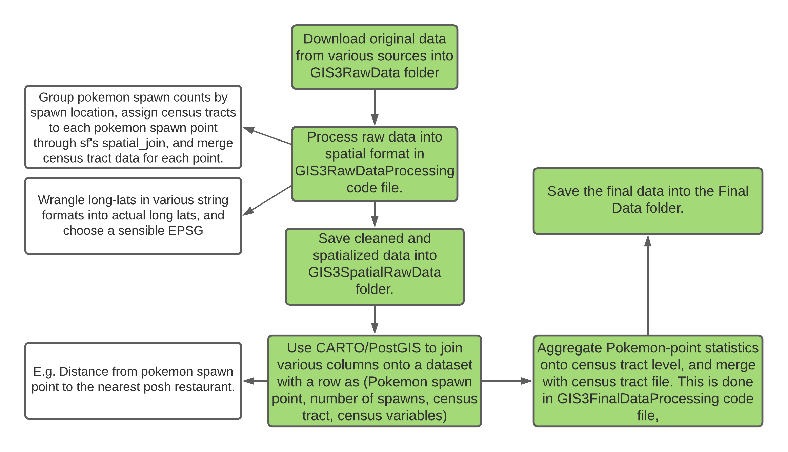

In the above workflow, I make two important clarifications.

First, all data is kept at pokmeon spawn point level until the final
step, in which we aggregate to census tract level polygons. For example,
I would assign each pokemon spawn point the census tract and census
tract variables, while each row reamins point-level. The reason is that
some variables, like `mPoshDistM`, require point-level PostGIS
computations before aggregation to the tract level. Another reason is
that for reasons apparent later on, the last step in analysis will
actually be a point pattern analysis of locations of Pokemon spawns.

The second clarification is about the PostGIS computations. Queries like
the “median distance in meters between a Pokemon spawn location and a
posh restaurant” for the `mPoshDistM` variable are awkward and
computationally expensive to complete in R. A much better way is to use
SQL and its spatial extension, PostGIS. I did these PostGIS computations
in CARTO, because I could dynamically see the queried results in a map.
Below is an example I used to that generates the `mStationKm` variable,
the median distance in kilometers (`mStationKm`) between each Pokemon
stop in the census tract and their nearest Lyft Bay Wheels stops. The
green points are the bike stations. The red points are pokemon spawns.

Two technical considerations for these PostGIS queries are projection
and buffer distance. Distance calculations are only meaningful if the
projection has a distance unit, so I convert everything to meters by
casting `geom` into `geography` as the CARTO documentation did. Buffer
distances for some variables (e.g. number of colleges within 2 km of a
pokemon spawn) also need some testing. If the distances that define
“nearby” were too long, every point would be close to all the colleges
in San Francisco. If the distances were too short, almost all of the
college counts for each pokemon point would be 0, even though some
points may be in another building in the college. So I had to select
buffer distances that produced enough variation in values without being
too unreasonable in magnitude.

#### Figure 3: Data wrangling in CARTO/PostGIS

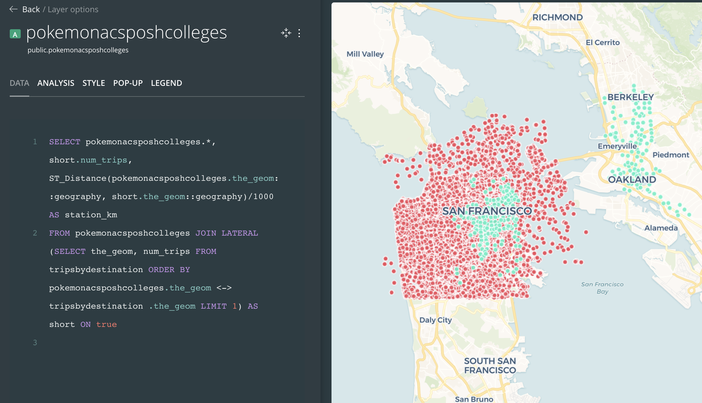

# 6 Methods Used: An overview

Recall our overarching question of **what covariates are most strongly
associated with the spatial intensity of Pokemon Go spawns?** My methods
are, briefly, as such:

-   **Exploratory data analysis.** I use R to create choropleth maps and
    a few plots of the dependent variable, pokemon spawn density,
    against each independent variable. The motivation is to provide some
    intuition on the dataset before going into some more complex methods
    like spatial lag regression models and point-pattern-analysis. I
    want to see how pokemon spawn density is spatially distributed, and
    what regressors’ spatial distributions are most similar to it.

-   **Spatial lag regression.** I use a spatial lag regression to
    formalize the association between regressors and pokemon density.
    Most coefficients were insignificant, and the magnitude of some of
    them were unintuitive. But the spatial lag model uncovers something
    much more interesting. It seems that more than being associated with
    its own regressor values, the spatial density of pokemon spawns in a
    census tract is strongly associated with the neighbors’ regressor
    values. It may very well be that pokemon spawns are correlated with
    themselves through space more than with any regressor like race or
    income. This is called spatial autocorrelation.

-   **Point pattern analysis.** Given that the spatial density of
    pokemon spawns seems to be very spatially autocorrelated, an
    intuitive next step would be to de-aggregate the data to point level
    and evaluate the extent to which Pokemon spawn locations are
    clustered. Thus, I do a point pattern analysis that calculates the
    average distance between pokemon points and their neighboring
    points.

# 7 Methods and results: Exploratory spatial data analysis

I use R to create choropleth maps and a few plots of the dependent
variable, pokemon spawn density, against each independent variable.

The plots of pokemon spawn density per 100 meters squared (x axis) and
each of the regressors on the Y axis can be shown below.

#### Figure 4: Plotting the pokemon spawn density per 100 meters squared against each regressor

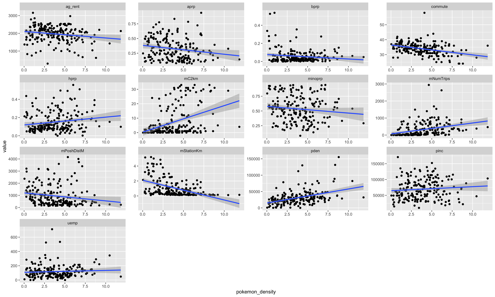 Some findings are
intuitive. As the median distance in a census tract between pokemon
spawn points and a bike station decreases, pokemon density rises. This
might suggest places with more short-trip facilities (e.g. bikes) are
associated with more pokemon activity. Consistent with Colley et al’s
findings that places with more minorities have fewer pokemon, the
correlation between pokemon density and the proportion of asian, black,
and hispanic populations are all negative. However, other relationships
are less intuitive. It seems like that as distance from a posh
restaurant increases, pokemon spawn density actually decreases.

I show some choropleth maps below.

#### Figure 5: Choropleth map of pokemon spawn density by census tract

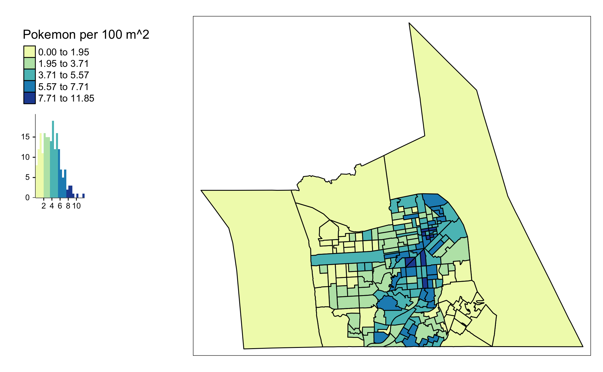 Observe
that the pokemon density is highest in the northeast parts of San
Francisco, e.g. downtown. However, there are also some high density
tracts in southern parts of San Francisco.

#### Figure 6: Choropleth map of proportion of population that’s black, census tract level

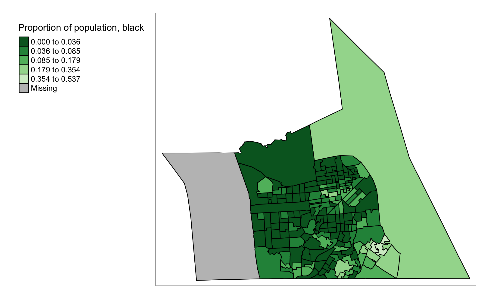 Lets’ compare this
map in figure 6 of the proportion of population that’s black to the map
in figure 5 of pokemon spawn densities. It does seem that some parts
with the highest proportion of black (**lightest** shade of green) are
all in peripheral regions that have few pokemon.

#### Figure 7: Choropleth map of proportion of median distance between pokemon spawn points and posh restaurants, census tract level

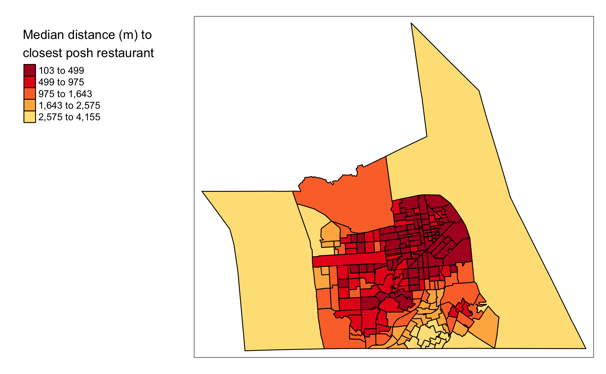 Finally, consider
figure 7. Median distance between a pokemon spawn and a posh restaurant
is highest in the northeast downtown area, just like pokemon density.
This conclusion seems to be opposite from the plot in figure 4.
Nonetheless, there are indeed a few tracts with short distances to posh
restaurants, but relatively low pokemon density.

# 7 Methods and results: Spatial lag regression

With the exploratory intuition, I then consider a spatial regression
model. While a nonspatial OLS model simply regresses the dependent
variable onto the independent variable, a spatial regression model will
make use of a weights matrix *W* to regress the dependent variable of
each observation on its neighbors’ values. Two spatial models are the
spatial lag and error form.

-   Spatial lag: *Y* = *p**W**Y* + *X* \* *β* + *u*
-   Spatial error: *u* = *λ**W**u* + *v*

The spatial lag model reflects a case when the influence of regressors
onto the dependent variable of interest is not the same as the spatial
scale of observation. In other words, the pokemon density of a census
tract is a function of not just its own regressor values, but also the
regressor values of neighboring tracts. The degree of this association
of price with neighboring regressors’ values is captured by p. 

In contrast, the spatial error model of either form is when the
regression residual is autocorrelated through space, where *λ* estimated
approximates this degree of residual spatial autocorrelation. This setup
represents nonsystematic omitted variables that have strong spatial
patterns. An example would be omitted tract effects not in the model.

The choice of spatial lag vs. spatial error model is determined by a
Lagrange Multiplier statistic. For the lag model, the null hypothesis is
*p* = 0, and for the error model, the null is *λ* = 0. We choose the
model that’s significant. If both models are significant, we compare
significance of the Robust Lagrange Multiplier Statistics (Anselin and
Rey, 2014).

The spatial lag regression is implemented in GeoDa space, which has the
following UI.

#### Figure 8: GeoDaSpace UI

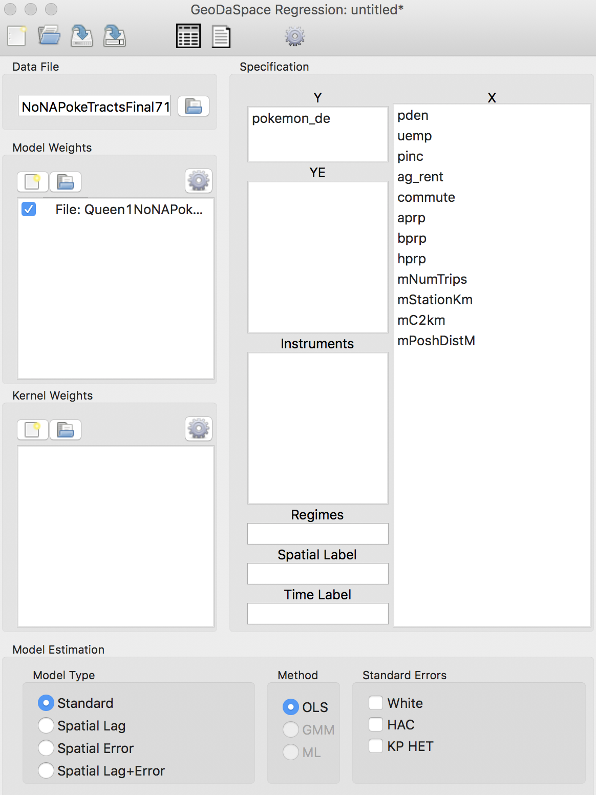

The Lagrange statistics are in figure 9: \#\#\#\# Figure 9: Lagrange
multiplier statistics to choose spatial lag vs. spatial error
specification 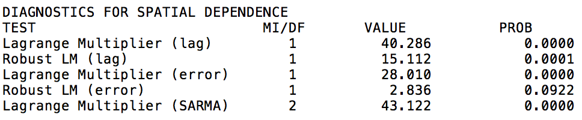

While both the lag and error Lagrange Multiplier statistics are
significant, only the lag model has a robust statistic. So I choose the
spatial lag specification, and present regression results below.

#### Figure 10: Spatial lag regression on census tract level data.

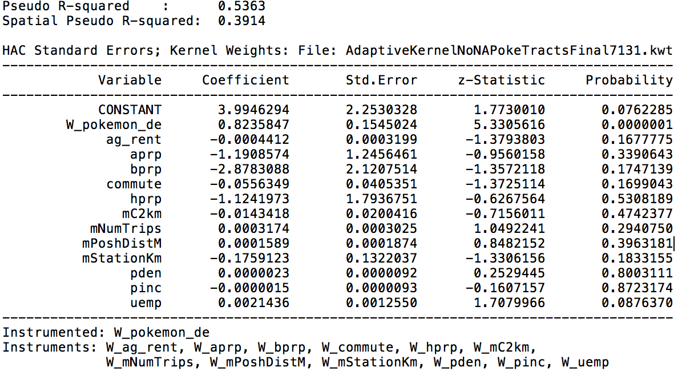

The pseudo R squared is similar to the R squared under a regular OLS,
and both versions show that the regressions fit the data decently well.

Most coefficients from this spatial lag model are insignificant. Like
Colley et al noted, the relationship between income (`pinc`) and pokemon
density is highly insignificant. Interestingly, also like Colley et al
showed for Chicago, all three regressors for proportion of population
that’s a minority (`aprp`, `bprp`, `hprp`) have a negative relationship
with pokemon density. But these regressors aren’t significant!

But the spatial lag model uncovers something interesting. The
coefficient on `W_pokemon_de` is the spatial lag coefficient *p*. This
coefficient is both high in magnitude and size.

So it seems that more than being associated with its own regressor
values, the spatial density of pokemon spawns in a census tract is
strongly associated with the neighbors’ regressor values. It may very
well be that pokemon spawns are correlated with their neighboring spawn
locations’ attributes more than with any of their own regressor values
like race or income. This is called spatial autocorrelation.

These spatial lag findings seem to point to a spatial autocorrelation
explanation of why some places have higher pokemon densities than other.
A spawn location appearing in a particular place may be more likely if
that location has many neighboring Pokemon spawn points. I further
explore this theory below in section 8.

# 8 Methods and results: Point pattern analysis

Given that the spatial density of pokemon spawns seems to be very
spatially autocorrelated, an intuitive next step would be to
de-aggregate the data to point level and evaluate the extent to which
Pokemon spawn locations are clustered. Thus, I do a point pattern
analysis that calculates the average distance between pokemon points and
their neighboring points.

#### Figure 11: Average distance of pokemon spawn points to nth nearest spawn point neighbor

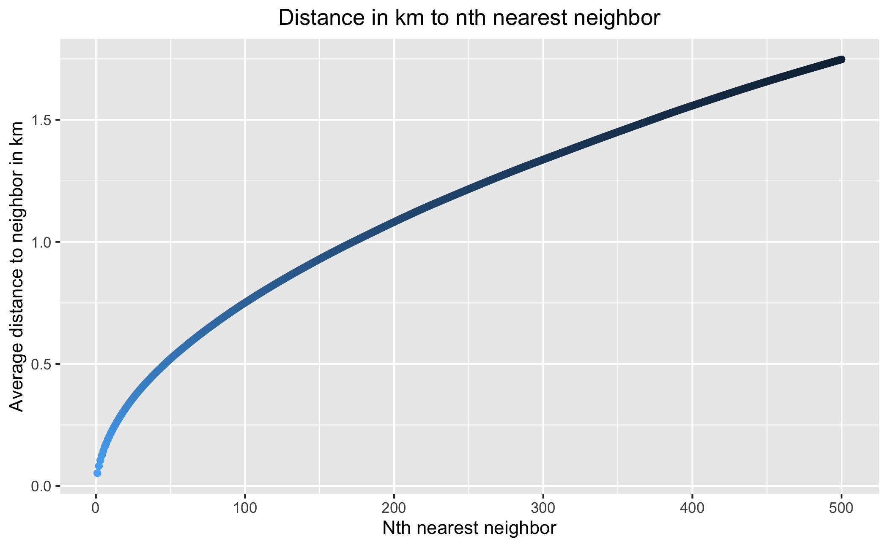 In figure 11,
I compute and graph the average distance of pokemon spawn points to
their 1st, 2nd, 3rd, … 500th nearest spawn points. For example the
average distance of pokemon spawn points to their 1st nearest spawn
points is computed by averaging the distance between each pokemon spawn
point and its 1st nearest spawn points. The operations are done in R’s
`spatstat` package (Gidmond 2021). Thank you Dr. Kolak for suggesting
this [tutorial
link](https://mgimond.github.io/Spatial/point-pattern-analysis-in-r.html).

This graph shows that the relationship between the *n* (as in *nth*
nearest neighbor) and the average distance to the *nth* nearest neighbor
is not linear. As *n* increases, the average distance rises more than
linearly, indicating that pokemon spawn points tend to be clustered very
heavily. Thus, it may be that pokemon density is best explained by
spatial autocorrelation: a spawn location appearing in a particular
place may be more likely if that location has many neighboring Pokemon
spawn points.

A next step would be to formalize this logic statistically. One way to
assess the significance of these average distances is to compare the
actual average distance from the *n*th nearest neighbor to the
distribution of average distances to the *n*th nearest neighbor *had we
simulated pokemon spawn points randomly*. Figure 12 shows a comparison
of actual vs. one round of randomnized spawn locations in San Francisco.
These computations are done in `spatstat`.

I focus on average distance to the 1st nearest neighbor distance, but
results are similar for higher orders of *n*.

#### Figure 12: Actual vs randomnized pokemon spawn locations in San Francisco

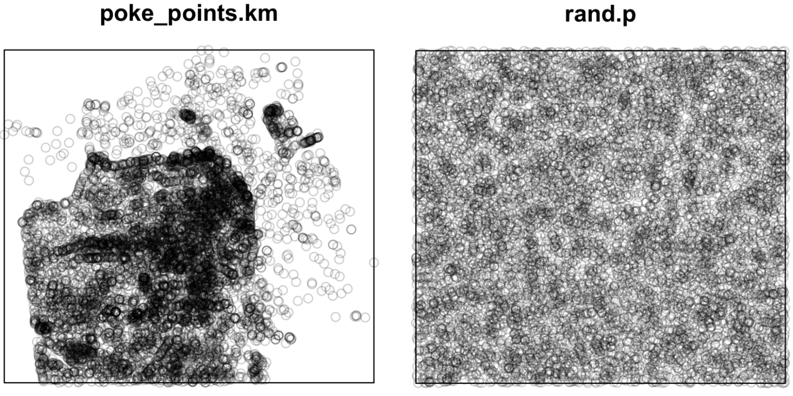 \#\#\#\# Figure 13:
Density of actual average distance to 1st nearest neighbor (red)
vs. average distances to 1st nearest neighbor after various rounds of
randomnization
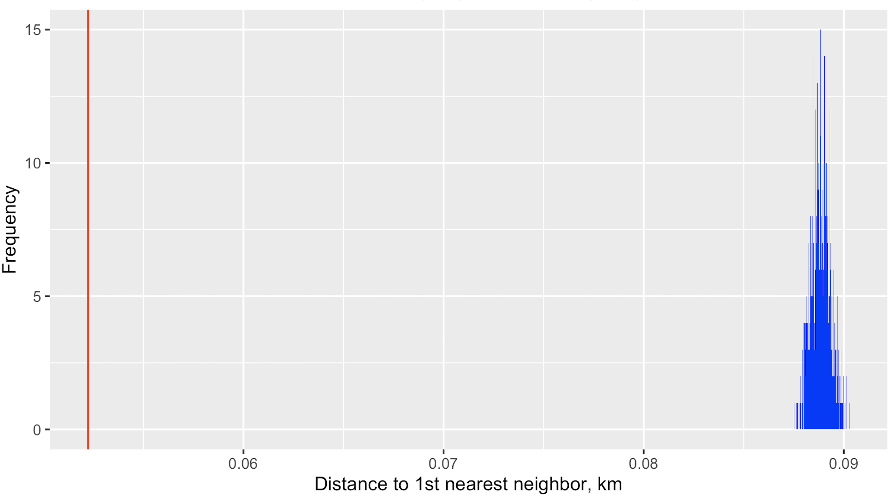

Figure 13 shows that our actual average distance to the 1st nearest
neighbor (in red) is much closer than any and all particular average
distance calculated from a randomized set of point locations (in blue).
We can formalize this into a **pseudo p value** based on randomnization
of point locations, and we get that the p value of less than \*\*0.001\*
is highly significant. Thus, the degree of clustering we see in Pokemon
point spawn locations look very different from if points were generated
randomly.

Intuitively, this means whatever algorithm the Pokemon Go company uses
to generate spawn locations is not random, but likely to favor
clustering. Thus, rather than being explaiend by any particular
regressor like race or income, pokemon density is best explained by
spatial autocorrelation. The algorithm behind spawn locations may be
structured such that spawn location appearing in a particular place may
be more likely if that location has many neighboring Pokemon spawn
points.

# 9 Conclusion:

My original research question was **What covariates are most strongly
associated with the spatial intensity of Pokemon Go spawns? Using
Pokemon data from San Francisco**. The analysis includes exploratory
mapping, spatial lag regression models, and point pattern analysis.

Most of the literature so far claim that there are strong associations
between spatial Pokemon intensity and regressors like amenities and race
of the neighborhood. While I do see some exploratory evidence of these
theories, my final results offer another theory.

I conclude that more than being associated with its own regressor
values, the spatial intensity of Pokemon Go spawns are most associated
with the presence of nearby Pokemon spawns. In other words, it may be
that Pokemon spawn locations are based off its neighbors’ locations. A
spawn location appearing in a particular place may be more likely if
that location has many neighboring Pokemon spawn points. There is a high
degree of spatial autocorrelation is at play. This is actually also
quite an intuitive explanation. The spatial lag model shows some
evidence of this spatial autocorrelation, and we show more evidnece of
this theory in the point pattern analysis.

The Pokemon Go algorithm behind spawn locations may be structured such
that spawn location appearing in a particular place may be more likely
if that location has many neighboring Pokemon spawn points. The initial
Pokemon Go spawn location might be dependent on some regressor like how
many posh restaurants are in a location, but the final spatial patterns
seem to be overwhelming the result of spatial autocorrelation, rather
than some direct relationship with variables like race, income, etc.

The methodological implications of these conclusions are two-fold.
First, my conclusions show that a careful evaluation of spatial
autocorrelation may be a critical component in answering problems of
inherently spatial nature, such as Pokemon Go spawn locations. Second,
Pokemon Go spawns are weakly associated with many intuitive regressors
like race or income. Yet for players of the game, their sense of
location is powerfully shaped by the geography of Pokemon Go. This is an
example of how augmented reality games like Pokemon Go may change or
create entirely new perceptions of geographic space.

# 10 Limitations and further work

Admittedly, I’ve had to make some important compromises in this study.

The main compromise is in data availability. Many open source,
community-based data scrapers for Pokemon Go did exist at one point, but
Niantic, the company behind Pokemon Go, have ordered them shut down. The
San Francisco dataset is more accessible, but was scraped in the earlier
years of Pokemon Go. The game has gotten many updates since then. I’ve
seen many coffee shops become Pokemon hotspots over the years, and as
the game matures, Niantic may be tuning their pokemon spawn algorithm to
e.g. help businesses advertise instead of just basing the algorithm on
spatial autocorrelation. Thus, the association between pokemon density
and the regressors of my study may be completely different today.

A secondary compromise is in regressor selection. Some of my variables,
like proximity to “posh restaurants”, are intuitive but arbitrary. Posh
restaurants were defined as boba shops and cafes, but we could broaden
the criteria to some extent.

I believe a further direction for this project would be to frame pokemon
density as a spatial machine learning problem. Instead of trying to find
regressors that make explanatory sense, we could split the pokemon
dataset into training and validation, then try to find a data generating
process that best predicts the data on pokemon density. Then, observing
the features of the best data generating process would perhaps enable
another analysis of why some areas have pokemon density much higher than
others.

Another completely different direction would be mapping the geography of
Pokemon Go through clustering algorithms. For example, we could do a
spatially constrained clustering analysis to identify hotspots of
Pokemon Go, then see if socioeconomic variables differ significantly
across clusters.

# 11 Works Cited

Please see the pdf file in
